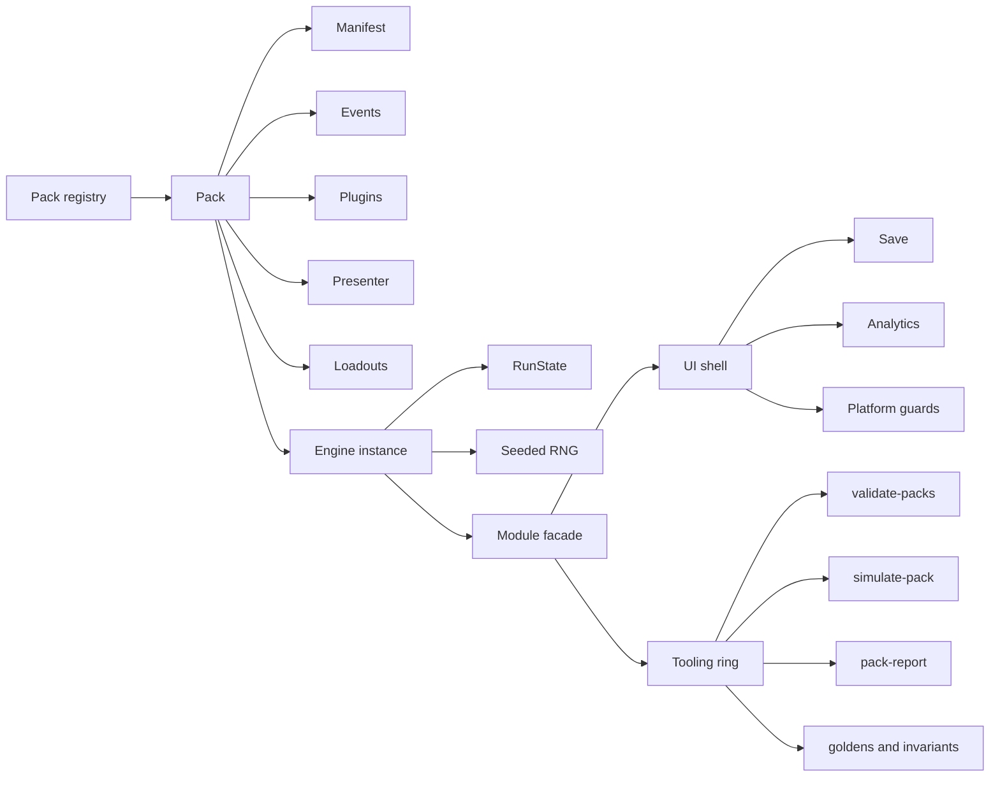
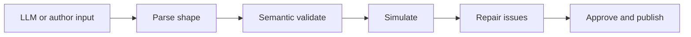

# Staff Engineer Review of big-break

## Executive summary

`big-break` is already a **serious internal engine**, not a toy. The repo has several things many early engines never get right: a genre-neutral core, deterministic seeded behavior, a real contract validator, a simulation layer, an external-facing `createGame()` entrypoint, a docs site that is built in CI, automated accessibility checks with axe, and telemetry that is structured enough to support balancing and retention analysis. That is strong Staff Engineer-level groundwork for “LLM-assisted game authoring,” especially for a repo that has only been evolving for about a week. citeturn23view1turn24view4turn16view0turn34view3turn23view0turn27view1turn28view2

My bottom line is this: **the repo is good for where it is, but it is not yet packaged as an external platform**. Right now it behaves like a strong internal framework with a careful maintainer, not yet like a product other teams could install, trust, version, and extend independently. The biggest gaps are not in the engine’s core idea. They are in the **productization layer**: clearer API boundaries, less reliance on hidden/global module state, a better external schema story, a stricter save/migration contract, more discoverable author docs, and standard open-source hygiene such as linting, dependency/security automation, and a public release/migration story. citeturn13view0turn24view3turn32view2turn23view1turn41view0turn40view4

The most important strategic conclusion is also the answer to your broader product question: **yes, there is something here outside users could want**. They would not want “yet another swipe engine” on its own. They would want the whole **authoring and safety stack** around it: deterministic refactors, pack validation, simulation, a paved-road scaffold, accessibility checks, telemetry conventions, and examples proving the engine can support multiple genres without rewriting the runtime. That bundle is the moat. A raw LLM can generate *a* swipe game; your repo is trying to make generated games **repeatable, testable, repairable, and maintainable**. That is a real value proposition. It just needs to be made obvious from the outside. citeturn23view1turn34view1turn34view3turn34view7turn35view0turn37view5

## Snapshot of current maturity

The repo’s current state across the key areas you asked about is summarized below.

| Dimension | Current repo state | Recommended SOTA practice |
|---|---|---|
| Schema and typing | Strong handwritten TS boundary types, declaration merging for pack-owned fields, and a semantic validator; `strict` applies only to a frontier of core files; several important surfaces still use `any` or open records. citeturn21view1turn21view2turn20view2turn32view3turn39view0 | Keep the semantic validator, but add a **formal ingestion schema layer** for external use: preferably Zod or generated JSON Schema at the edge, with semantic validation as a second pass. Expand `strict` to packs, save, analytics, and presenter surfaces. |
| Validation and LLM safety | Very good semantic validation: never-throws contract, typo suggestions, effect/requires vocabulary checks, chain target checks, and author-facing formatting for repair loops. Simulation exists as a separate stage. citeturn16view0turn16view2turn16view3turn15view4turn34view3turn34view7 | Add a **first-class LLM pipeline contract**: `generate → parse → validate → simulate → auto-repair → approve`. Emit machine-readable issue codes and stable JSON Schema artifacts for external tools. |
| Runtime and state | Good isolated engine instances with `createEngine(pack)`, but module-level `CURRENT` and `DEFAULT` still exist, and the public API still exports `useContentPack`/`activePack`. Save and analytics also keep module-global state. citeturn13view0turn24view3turn32view2turn44view6 | Make instances the default mental model. Keep global compatibility APIs as internal/legacy only. Introduce an explicit `GameRuntime` or `Session` object that owns engine, save, analytics, and UI wiring. |
| API design | There is a real external entrypoint: `definePack`, `validatePack`, `createEngine`, `createGame`. The README states this clearly. But the npm package is still `"private": true`, which means the platform story is not yet real for outside users. citeturn24view4turn24view0turn23view1turn43view0 | Publish a package with subpath exports such as `@big-break/core`, `@big-break/browser`, and optionally `@big-break/cli`. Document a stable “Hello world pack” that works outside this monorepo. |
| Docs and author UX | Better than most early engines: README has architecture and build flow, docs-site is isolated, docs are CI-gated, and `new-pack` gives a scaffold. citeturn23view1turn23view0turn40view1turn34view1 | Reorganize docs around **outside-user jobs-to-be-done**: install, first pack, validate, simulate, ship, debug, migrate, co-write with an LLM. Add one “five-minute success path.” |
| CI and testing | Very strong for behavior: build-on-dist, typecheck frontier, engine-neutrality gate, contract validation, content lint, sim checks, Playwright UI checks, and golden masters. citeturn40view0turn44view0turn27view4turn26view0 | Add standard ecosystem hygiene: ESLint, formatting, dependency update automation, dependency audit, SBOM/license reporting, and optional CodeQL or equivalent. |
| Security and dependency tooling | Pinning is careful, but I did not find repo-level Dependabot, CodeQL, or a visible security policy/config in the reviewed files. Dev dependencies are minimal and focused on tests/build. citeturn44view3turn41view0 | Add `dependabot.yml`, automated `npm audit` or `pnpm audit` gate, security policy, and release checks for lockfile drift and vulnerable packages. |
| Accessibility | Better than expected: axe-core is injected in UI smoke tests and serious/critical WCAG violations fail the run. Reduced motion is persisted in settings. citeturn27view1turn32view3 | Add keyboard-navigation coverage, focus-order assertions, color-contrast snapshots, and author guidance for content accessibility. |
| Telemetry and debugging | Telemetry is unusually mature for this stage: explicit events, local ring buffer, PostHog EU, scheduled pull-back into the repo, and coverage analysis. citeturn28view2turn28view4turn44view4turn44view6 | Add a local in-browser debug panel and reproducibility tools: visible seed, current card id, plugin traces, and downloadable run timeline. |
| Versioning and migration | Manual release workflow exists, package version exists, and some save migrations exist. But migration strategy is still local and ad hoc. citeturn40view4turn43view0turn32view3 | Introduce explicit contract versions for pack schema and save schema, migration docs, deprecation windows, and changelog automation. |

A simple way to visualize the current architecture is this:



That overall shape is good: packs own content and plugins, the engine owns neutral mechanics, and tooling sits above the runtime. The main weakness is that the public surface still exposes some module-scoped behavior that makes the isolation story less crisp than it should be for external users. citeturn35view0turn13view0turn24view3turn23view1

## Architecture and boundary review

### Current status

On the core architectural question, the repo is on the right path. `js/engine.ts` explicitly documents two surfaces: isolated instances via `createEngine(pack)` and a classic module-level surface delegating to a default instance. The registry centralizes pack registration, and the pack files show real separation between genre content and engine code. The README also makes the engine/manifest/plugins/presenter split clear. citeturn13view0turn35view0turn37view2turn37view5turn23view1

The pack system is doing real work. `music` and `love-island` are not merely reskins; they prove the engine can host quite different content taxonomies through manifest data, plugins, presenters, and loadouts, without changing the engine core. The `probePack` in the registry is especially strong as an architectural test fixture, because it encodes the claim that the core should remain genre-neutral. citeturn35view0turn37view2turn37view6

### Concrete issues found

The main architectural issue is **mixed messaging around state and isolation**. The good news is that `createEngine(pack)` exists. The less good news is that the API still publicly exports `useContentPack` and `activePack`, and the README architecture section still describes the engine as reading “the active pack.” That means the repo currently supports both an instance-first design and a hidden-session-default design at the same time. Internally that may be a practical bridge; externally it will confuse users and LLMs. citeturn24view3turn23view1turn13view0

There is also still meaningful module-global state outside the engine itself. `js/save.ts` keeps a module-level namespace `NS`, and `js/analytics.ts` keeps process-wide analytics state and tags each event with an active pack id. That is manageable in a single-page app, but it weakens the story for multi-pack embedding, side-by-side previews, concurrent simulations in the browser, or external host apps wanting tighter control. citeturn31view0turn32view3turn44view6

The clearest concrete bug I found is in save loading. `js/save.ts` comments say a run should resume only if it belongs to the current pack and explicitly mention a belt-and-suspenders `packId` check, but the implementation shown only verifies `version === 1` and `phase !== 'ended'`. That is a real discrepancy between intent and code. citeturn32view1turn32view2

### Prioritized recommendations

**Short term**

Make the instance API the default in docs and author examples. Keep module-level helpers for compatibility, but mark them as internal or legacy in the public docs. A new author should meet `createEngine(pack)` and `createGame({ pack })` first, not `useContentPack()`. citeturn24view0turn24view3turn23view1

Fix the save guard bug immediately. That is not a style issue; it is correctness. If a bad import or stale local state can cross pack boundaries, it will create hard-to-debug corruption. The comment already tells you the intended rule. citeturn32view1turn32view2

**Medium term**

Introduce a `GameRuntime` object that owns:
- engine instance,
- save adapter,
- analytics adapter,
- platform hooks,
- and UI bootstrap.

That would turn several hidden module-scoped assumptions into explicit composition. It would also make testing simpler because one object would define the runtime boundary.

**Long term**

Split the repo conceptually into three layers:
- `core`: schema-neutral engine and validation,
- `browser`: UI shell, save, telemetry, mobile guards,
- `authoring`: CLI, scaffolding, reports, simulation, docs helpers.

That is the cleanest route to an eventual public package strategy.

### Patch example

A minimal patch for the save guard would look like this:

```ts
// js/save.ts
export function loadRun(expectedPackId?: string) {
  const run = read(runKey());
  if (!run || run.version !== 1 || run.phase === 'ended') return null;

  if (expectedPackId && run.packId && run.packId !== expectedPackId) {
    return null;
  }

  return run;
}
```

Even better would be to pass the expected pack through a runtime/session object so the check is not optional.

## Pack contract and LLM authoring review

### Current status

This is one of the best parts of the repo. `validatePack(candidate)` is not superficial. It is designed as a **never-throws**, issue-collecting validator that can survive hostile or malformed input and return a repair-oriented report rather than crashing. It checks schema-ish structure, but also meaningful authoring semantics: unresolved win gates, missing `statMeta`, unknown resources, unknown effect verbs, missing chain targets, and invalid `requires` keys, with “closest match” suggestions. That is exactly the right instinct for LLM-authored content. citeturn16view0turn16view1turn16view2turn16view3turn15view4

The validator also already uses the engine’s real vocabularies instead of a duplicated copy. `REQUIRES_NEUTRAL_KEYS` and `CORE_EFFECT_VERBS` are exported from the engine so the validator and cross-pack checks stay tied to the runtime truth. That is architecturally sound. citeturn13view2turn13view3turn16view2turn16view3

The repo also distinguishes **validation** from **simulation**, which is the right model. The validator answers “is this pack structurally and semantically coherent?” while the toolchain answers “does it actually play and balance reasonably?” The comments in `js/validate.ts` and the `simulate-pack` tooling make that split explicit. citeturn15view6turn34view7turn34view8

### Concrete issues found

The missing piece is not validator quality. It is **schema portability**. Right now the contract is strong inside this repo, but it is harder for outside tools to consume because the first-class contract is handwritten TypeScript plus a handwritten validator. That is excellent for control, but weaker for ecosystem interoperability. There is no visible Zod layer, no generated JSON Schema, and no published machine-readable authoring spec that an external CLI, Monaco editor, or remote LLM tool could consume directly. Also, the package does not currently depend on Zod at all. citeturn24view4turn16view0turn43view0turn44view3

Typing is also still uneven. `RunState` has improved and explicitly notes that the old catch-all index signature was removed, but important escape hatches remain: `SwipeResult` still has `[key: string]: any`, `loadMeta()` returns `any`, and several arrays and summary surfaces are still typed loosely. There is also a strictness frontier that currently stops at `engine.ts`, `types.ts`, `config.ts`, `platform.ts`, `validate.ts`, and `api.ts`, leaving packs and shell surfaces outside the `strict` gate. citeturn21view2turn20view2turn32view3turn39view0

Pack-specific type augmentation through declaration merging is powerful, but it is also a little magical for external authors. It works well for an experienced maintainer in-repo. It is less friendly for a newcomer or an LLM trying to understand “where a field comes from,” especially when multiple packs augment the same shared types in different files. citeturn21view1turn37view2turn37view6

### Prioritized recommendations

**Short term**

Keep the handwritten semantic validator. It is already one of the repo’s strongest assets. Do **not** replace it outright with Zod. Instead, add a **thin parse layer** in front of it:
- Zod for shape parsing, defaulting, and editor-facing schema,
- your current validator for semantic checks and playability-focused defects.

That combination gives you the best of both worlds.

**Medium term**

Generate and publish a machine-readable schema artifact:
- JSON Schema file for packs,
- or a Zod schema exported from the package,
- plus a stable error-code catalog.

That makes external editor integrations, CLI diagnostics, and LLM toolchains much easier.

**Long term**

Model the pack contract explicitly as a staged pipeline:



That should become the documented “official” authoring loop.

### Should you use Zod

Yes, but **surgically**.

Use Zod for:
- parsing untrusted generated JSON,
- defaults and coercion at the ingestion edge,
- editor/tooling schema generation,
- and clearer external API docs.

Do **not** use Zod as a substitute for your semantic validator. Zod will not replace checks like:
- unknown pack-specific effect verbs,
- unresolved chain targets,
- unreachable gates,
- or “this card can never appear.”

Those are domain validators, and your current repo already handles them well. citeturn16view2turn16view3turn15view2

A good pattern would be:

```ts
const parsed = PackEnvelopeSchema.safeParse(input);
if (!parsed.success) return zodIssues(parsed.error);

const semantic = validatePack(parsed.data);
if (!semantic.ok) return semantic;
```

### Ready-to-copy LLM prompt for pack generation

Use this as the default system prompt for a co-authoring model:

```text
You are generating a Big Break content pack.

Your job is to produce a VALID, REPAIRABLE pack that fits the engine contract.

Rules:
- Output only the pack file content.
- Prefer simple, complete, internally consistent content over ambitious but risky content.
- Every id must be unique and stable.
- Only use stats, resources, paths, effect verbs, and requires keys that are declared.
- Do not invent engine behavior.
- If a feature needs a new effect verb or requires key, declare it in a plugin instead of assuming the engine supports it.
- Keep prompts and choices short, concrete, and player-readable.
- Avoid cards that can never appear because of impossible gates.
- Avoid chainEventId values that do not exist.
- Provide a tutorialStart only if tutorialEvents exists.
- Keep the starter pack small but playable.

Author in this order:
1. manifest
2. loadouts
3. plugins
4. tutorial events
5. normal events
6. presenter and summarize

After writing the pack, run a self-check:
- all ids unique
- all references resolve
- all requires keys are valid
- all effect keys are valid
- all path ids exist
- all chain targets exist
- all tutorial references are valid
- no undeclared stat/resource names appear
```

### Ready-to-copy validation feedback loop

Use this when feeding validation output back into the model:

```text
Your previous pack failed validation.

Fix only the reported issues.
Do not rewrite unrelated content.
Preserve all valid ids and structure unless a reported issue requires a change.

Validation report:
{{formatValidationOutput}}

Repair instructions:
- Resolve errors first.
- Warnings may be improved if the fix is small and low-risk.
- If an unknown key is likely a typo, use the suggested nearest match.
- If a reference target is missing, either create the target or remove the reference.
- If a gate is impossible, simplify it rather than adding new engine behavior.
- Return the full corrected file content only.
```

## External product fit and author experience

### What outside users would expect

An outside user evaluating this engine would typically expect six things.

First, **a five-minute first success**: install package, import one thing, run one minimal game, then edit one event and see the change.

Second, **a clear story for what lives where**: engine, pack, plugin, presenter, save, analytics, docs.

Third, **a stable authoring contract**: enough schema help that they do not need to reverse-engineer your internal patterns.

Fourth, **a CLI paved road**: scaffold, validate, simulate, preview, and publish.

Fifth, **examples that feel real**: at least one tiny “probe” example and one midsize example.

Sixth, **confidence that generated content will not silently rot**: good errors, simulation, tests, and migrations.

Your repo already has many ingredients for this. The README exposes `js/api.ts` as the authoring surface, `createGame()` as the embedding story, and `new-pack.mjs` as a one-command scaffold. The docs site is isolated and CI-gated, and the probe pack is already effectively a teaching example. citeturn23view1turn24view0turn34view1turn23view0turn35view0

### The main product-fit problem

The strongest reason an outside user might **not** adopt the engine today is simple: the repo still looks more like a private application framework than a public platform. `package.json` is `"private": true`, the docs are good but still repo-centric, and a lot of the usage story assumes a consumer is comfortable living inside this monorepo structure rather than installing a released library. citeturn43view0

That means the answer to your own question is nuanced:

- If someone wants a one-off swipe game and is happy to let an LLM improvise, they may not need your engine.
- If someone wants a game they can **iterate, test, debug, rebalance, and safely grow**, your engine is more valuable than a raw LLM-built custom app.
- Today, that value is clearer to a technical maintainer than to an outside adopter.

### API design evaluation

The public API itself is promising. `definePack`, `validatePack`, `createEngine`, and `createGame` are the right kinds of things to expose. The `createGame()` embed path is also tested, not merely documented, which is excellent. citeturn24view4turn24view0turn27view4

What is missing is **surface discipline**. External users should not feel forced to understand:
- module-global fallback state,
- strict-frontier workarounds,
- registry patching,
- or monorepo HTML entry wiring.

That internal complexity should be hidden behind a smaller external story.

A stronger external API would look like this:

```ts
import { createGame, definePack } from '@big-break/browser';
import { validatePack } from '@big-break/core';

const pack = definePack({...});
const report = validatePack(pack);
const game = createGame({ pack });

await game.start(document.getElementById('app'));
```

The repo already has the concepts. It just does not yet present them in this cleaner package form. citeturn24view0turn24view3turn43view0

### Recommended README and docs structure

Your current README is strong for an internal maintainer. For outside users, I would restructure it like this:

```text
README.md
- What Big Break is
- Who it is for
- 5-minute hello world
- Why use this instead of asking an LLM to build from scratch
- Install
- Your first pack
- Validate and simulate
- Embed in a page
- Ship to production
- Where to go next

docs/
- quickstart/
  - hello-world-pack
  - first-plugin
  - first-presenter
- concepts/
  - engine-vs-pack
  - manifest
  - plugins
  - presenter
  - state-and-saves
  - validation-and-simulation
- authoring/
  - pack-contract
  - event-writing-guide
  - llm-coauthoring
  - repair-loop
  - accessibility-for-authors
  - telemetry-for-authors
- api/
  - core
  - browser
  - cli
- operations/
  - release-process
  - migrations
  - debugging
  - security
```

The key change is to organize around **what an adopter wants to do**, not around how the repo happens to be laid out.

## Delivery, quality, and operational readiness

### Current status

The repo’s quality net is genuinely strong. `pages.yml` runs build, strict typecheck on the core frontier, engine-neutrality checks, pack contract validation, content lint, sim checks, and docs build, all against emitted `dist/` before deploy. `package.json` also exposes a high-friction but real `check` and `ci` script set, including multiple UI checks. citeturn40view0turn44view0turn44view1

Testing breadth is also impressive. The repo has engine tests, instance tests, validator tests, save tests, golden tests, pack-specific tests, and Playwright-driven UI tests. The create-game embed scenario is explicitly tested. Accessibility is also enforced via an axe scan in smoke tests, failing on serious and critical WCAG 2 A/AA issues. citeturn26view0turn27view4turn27view1

Telemetry is ahead of where most early-stage engines are. The repo documents event schemas, local ring-buffer analysis, PostHog EU integration, scheduled pullback into the repo, and coverage reporting for unseen content. That is excellent for balancing and product learning. citeturn28view2turn28view4turn44view4turn44view6

### Concrete issues found

The operational gaps are mostly in **standard ecosystem hygiene**, not in game-specific rigor.

I did not find an obvious ESLint or Prettier setup in the reviewed package and repo files, and I did not find reviewed evidence of Dependabot, CodeQL, or a visible security automation layer beyond your own tests and workflow gates. The `.github` tree contains workflows, but not the broader dependency/security productization many outside adopters now expect. citeturn44view3turn41view0

Versioning and migration are only partly formalized. There is a manual release workflow and a package version, but the release body is still hardcoded, and migration handling appears local and ad hoc. Save import/export uses `v: 1`, run state uses `version: 1`, and `loadMeta()` contains an inline migration, but there is not yet a visible public migration policy for pack contract changes or save evolution. citeturn40view4turn43view0turn32view3

There is also no obvious **bundle/performance budget policy** in the reviewed files. The build is deliberately simple — `tsc` to `dist/`, no bundler — which keeps behavior predictable, but there is no visible size budget, chunk strategy, or RUM-style performance gate. That is fine for now, but an external platform should eventually state what it optimizes for. The one runtime consistency mechanism I did find is strong: `js/version.ts` defines a CSS↔JS contract so the app can detect mixed deploys and heal stale styles. citeturn23view1turn42view0

On accessibility, the runtime posture is good, but child-safety posture looks under-specified. The default saved settings include sound, music, and reduced motion, but I did not find a dedicated child-safe or content-safety mode in the reviewed settings path. For an engine you imagine children using through LLM-authored games, that is a future requirement, not a nice-to-have. citeturn32view3

### Prioritized recommendations

**Short term**

Add:
- ESLint,
- formatting policy,
- Dependabot,
- `npm audit` in CI,
- and a `SECURITY.md`.

These are not glamorous, but they matter the moment external users start trusting the repo. They also reduce maintainer toil.

**Medium term**

Introduce explicit versioned contracts:
- `packContractVersion`,
- `saveSchemaVersion`,
- and a documented migration pipeline.

That will matter a lot once LLMs generate packs against older docs or examples.

**Long term**

Add a small “developer observability” layer:
- dev panel showing seed, card id, active pack, and plugin trace,
- exportable run timeline JSON,
- replay-from-seed UI,
- and content coverage visualization in docs.

That would make the engine unusually maintainable for AI-assisted content generation.

## Recommended target state and concrete patches

### Recommended roadmap

**Short term**

Your best next moves are:

1. **Fix the save/load cross-pack guard.** This is a correctness issue, not architecture polish. citeturn32view1turn32view2  
2. **Make instance-first usage the primary public story.** Keep global helpers, but stop teaching them first. citeturn24view3turn23view1  
3. **Publish a real external quickstart.** One outside-style “hello world” pack plus one validation/simulation loop. citeturn34view1turn23view1  
4. **Add standard dependency/security automation.** The repo-specific rigor is already high; standard hygiene is the missing layer. citeturn41view0turn44view3  
5. **Add a thin schema-at-the-edge layer.** Zod or JSON Schema at ingestion, semantic validation after parse. citeturn16view0turn24view4

**Medium term**

1. Split the public API into `core`, `browser`, and `cli`.  
2. Expand `strict` coverage into packs, save, analytics, and presenters. citeturn39view0  
3. Replace magical declaration-merging as the *primary* external teaching path with more explicit extension points.  
4. Document the official LLM co-authoring loop as a product feature, not an implied internal habit.

**Long term**

1. Publish the package.  
2. Make migrations first-class.  
3. Add child-safe/content-safe mode and author guidance for it.  
4. Add browser-side debugging overlays and state inspection.

### Patch example for a stronger runtime boundary

A simple shape for the longer-term API could be:

```ts
export interface GameRuntime {
  engine: Engine;
  validate(): PackValidation;
  start(root?: HTMLElement): Promise<void>;
  save(): void;
  dispose(): void;
}

export function createRuntime(opts: {
  pack: Pack;
  analytics?: AnalyticsAdapter;
  saves?: SaveAdapter;
  mobileGuards?: boolean;
}): GameRuntime {
  const engine = createEngine(opts.pack);
  const validation = validatePack(opts.pack);

  return {
    engine,
    validate: () => validation,
    async start(root) {
      if (!validation.ok) throw new Error(formatValidation(opts.pack.id, validation));
      // wire browser shell here
    },
    save() {
      // delegate to save adapter
    },
    dispose() {
      // clean up listeners and adapters
    },
  };
}
```

That would make the architecture easier to reason about than a blend of instance APIs plus hidden module defaults.

### Final assessment

As a codebase-wide Staff Engineer judgment: **this repo is better than “okay for where you’re at.”** It already shows strong architectural intent, strong validation thinking, and unusually mature quality gates for such an early stage. The engine is not the weak part. The weak part is that the repo has not yet fully decided whether it is:

- an internal game codebase with a reusable core, or
- a public engine platform for outside authors and LLM workflows.

Right now it leans heavily toward the first, with strong foundations for the second. That is a very good place to be after a week. The highest-value move now is not “more engine cleverness.” It is **turning the existing rigor into a simpler, clearer, externally trustworthy product surface**. citeturn13view0turn23view1turn24view0turn34view3turn40view0